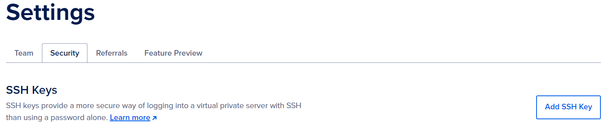
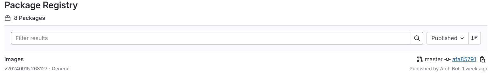
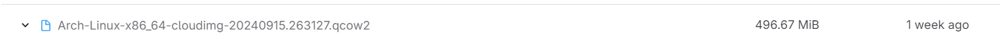
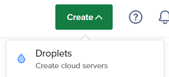
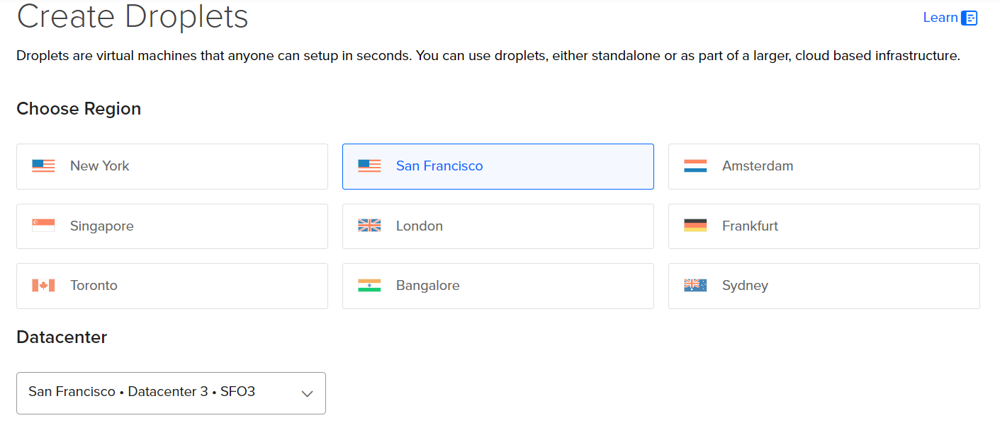
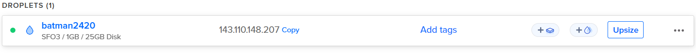

# Creating a Remote Server on DigitalOcean

## Table of Contents
1. Introduction
2. SSH Keys
3. Steps to generate an SSH Key
4. Copy the Contents of your SSH Public Key
5. Adding SSH Public Key to your DigitalOcean account
6. Custom Arch Linux Image
7. Creating a Droplet running Arch Linux

## Introduction
In this tutorial, you will learn how to create a remote server using DigitalOcean. This tutorial will cover:
- Generating SSH Keys
- Adding a custom Arch Linux image
- Creating a Droplet running Arch Linux
- Connecting to your droplet from your local machine using SSH
## SSH Keys
### What are SSH Keys
SSH (Secure Shell) keys are a pair of cryptographic keys that provide a secure connection between a device and server over an unsecured network. SSH uses encryption to scramble data which makes it more secure than a normal password.
### Steps to generate an SSH Key
1. Make sure your device has ssh-keygen installed.
2. If the .ssh directory doesn't exist, create it using this command
```powershell
mkdir -p ~/.ssh
```
3. To create a new SSH key pair, run the below command
```powershell
ssh-keygen -t ed25519 -f ~/.ssh/do-key -C "your email address"
```
This command generates an SSH key pair with a private and public key. The private key will be saved as "do-key" and the public key will be saved as "do-key.pub". The command will also associate your email with the key as a comment.
## Copy the contents of Your SSH Public Key
For the next step, you will need to copy the contents of your SSH Public Key
Run one of the following commands to copy your public SSH Key to the clipboard based on your operating system:

In PowerShell:
```powershell
Get-Content C:\Users\your-user-name\.ssh\do-key.pub | Set-Clipboard
```
For MacOS users:
``` 
pbcopy < ~/.ssh/do-key.pub
```
For Linux:
``` bash
cat ~/.ssh/do-key.pub | xclip -sel clip
```
## Adding SSH Public Key to your DigitalOcean account
1. Log into your DigitalOcean account
2. Navigate to Settings > Security > SSH Keys
3. Click on add SSH Key

4. Paste the contents of your public key into the Public Key box and name it. 

## Custom Arch Linux image
1. Download an Arch linux image from [Arch Linux](https://gitlab.archlinux.org/archlinux/arch-boxes/-/packages/) website.
2. Go to the latest images folder

3. Select the .qcow file shown below and download

We are using .qcow as it is supported by DigitalOcean for custom images and can be easily implemented.
## Creating a Droplet running Arch Linux
1. Click on the green "Create" dropdown found on the upper right corner on DigitalOcean and click on "Droplet".

2. You will be redirected to a "Create Droplets" page where you must create your droplet.
3. In this tutorial, we will be choosing the options as described and in the screenshots below.
4. Select the San Francisco region and SFO3 Datacenter.

5. For images, click on custom image, then add image then upload the Arch Linux image that you downloaded earlier in the tutorial.
6. For this tutorial, we will choose the Basic plan for the droplet type and the cheapest option under the Premium AMD CPU option.
7. For the authentication method, select SSH Key and choose the key that was created earlier.
8. Choose 1 droplet for the quantity and give the droplet a hostname.

## Connecting to your droplet
1. Once the droplet is created, go to the projects section and hover over the IP address of the droplet.

2. Copy the IP address.
3. Run the command below with the IP address that you copied from your droplet.
``` powershell
ssh -i ~/.ssh/do-key arch@IP-address
```
## Conclusion
Congratulations! You have successfully generated an SSH Key, created an Arch Linux server on DigitalOcean, and connected your server using SSH. You can now start customizing and managing your new server.
## References

**Cloudflare.** (n.d.). What is SSH? Retrieved September 24, 2024, from [https://www.cloudflare.com/learning/access-management/what-is-ssh/](https://www.cloudflare.com/learning/access-management/what-is-ssh/)

**CIT 2420 Class.** (n.d.). SSH Key. Retrieved from GitLab: [https://gitlab.com/cit2420/2420-notes-f24/-/blob/main/2420-notes/week-two.md](https://gitlab.com/cit2420/2420-notes-f24/-/blob/main/2420-notes/week-two.md)